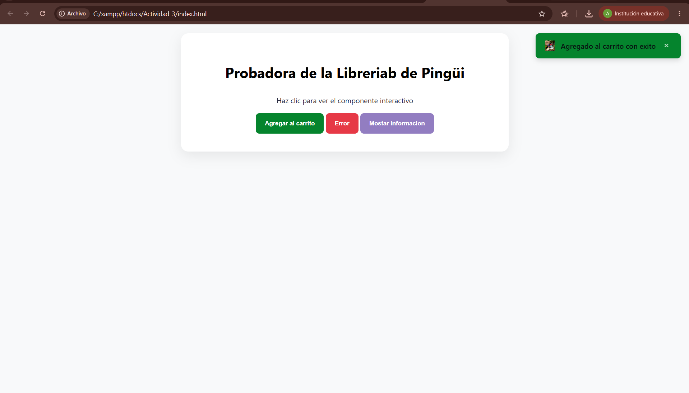
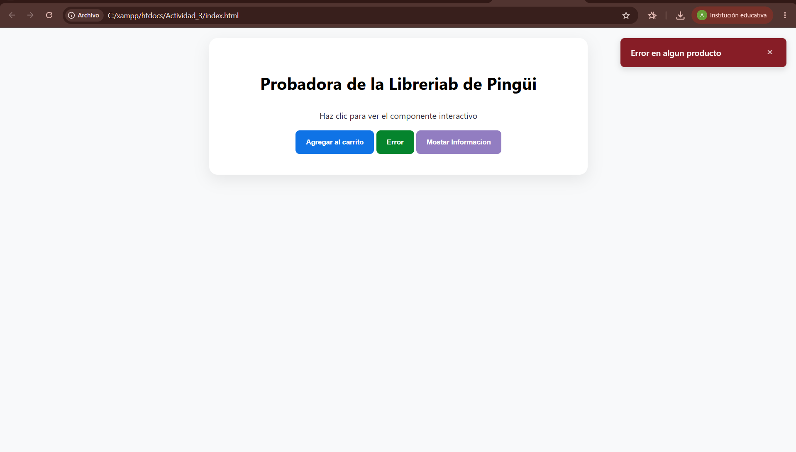

# Actividad 3. Componente Visual con JS - ToastJS  
 - Componente Visual Reutilizable

## Portada

**Materia:** Programación Web  
**Proyecto:** Desarrollo de un Componente Visual Reutilizable  
**Nombre del componente:** PingüiToast  
**Alumno:** Ariel Betsabe López Guerrero  
**Profesor:** Martinez Nieto Adelina  
**Fecha:** 05-07-2026
---

## Descripción
PingüiToast es una librería que permite mostrar notificaciones emergentes (Toast Notifications) de forma rápida, sencilla y reutilizable.
---

## Problema que resuelve

En muchas páginas web es necesario informar al usuario sobre diferentes acciones sin interrumpir su navegación.

por ejemplo:
* Confirmar cuando un producto se agrega con éxito al carrito de la tienda.
* Alertar de manera llamativa si ocurre un error en algún formulario.
* Mostrar avisos rápidos o información importante de stock sin usar molestos menús interactivos.

---

## Instalación

Para integrar **PingüiToast** en cualquier proyecto, solo debes clonar o descargar las carpetas de este repositorio e incluir los archivos en el `<head>` y al final del `<body>` de tu documento HTML de la siguiente manera:

### 1. Vincular el archivo CSS
Añade la hoja de estilos dentro de la etiqueta `<head>` de tu archivo HTML:
```html
<link rel="stylesheet" href="css/componente.css">
```
### 2. Vincular el archivo JavaScript
Añade el script justo antes del cierre de la etiqueta </body> para asegurar una carga correcta
```html
<script src="js/componente.js"></script>
```
---
### Capturas de pantalla 
 
 .

 .


